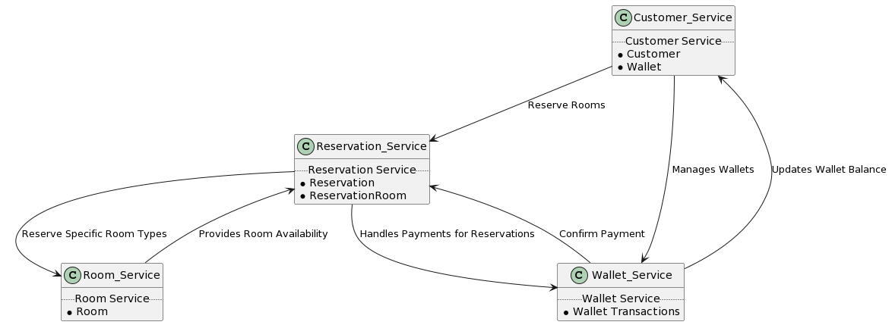

Voici les étapes pour lancer le projet :

---

## Prérequis

- Installer [.NET 7 SDK](https://dotnet.microsoft.com/download/dotnet/7.0) ou une version ultérieure.

## Étapes pour lancer le projet

1. **Accéder au dossier du projet**

   Ouvrez un terminal et naviguez jusqu'au dossier de votre projet :

   ```bash
   cd .\HotelDDD\
   ```

2. **Lancer le Conteneur de la Base de Données**

   Assurez-vous que Docker est installé et fonctionne sur votre machine. Lancez le conteneur de la base de données à l'aide de Docker Compose :

   ```bash
   docker-compose up
   ```

   Cela démarrera votre base de données SQL Server dans un conteneur Docker. Assurez-vous que le service `db` est configuré correctement dans votre fichier `docker-compose.yml`.

3. **Restaurer les Packages NuGet**

   Restaurez les packages NuGet nécessaires pour votre projet .NET :

   ```bash
   dotnet restore
   ```

   Cela téléchargera et installera toutes les dépendances nécessaires pour votre projet.

4. **Lancer l'Application**

   Exécutez votre application ASP.NET Core :

   ```bash
   dotnet run
   ```

   Cette commande compile et lance l'application. Les logs dans le terminal vous indiqueront sur quel port  l'application écoute (par défaut, cela sera généralement `http://localhost:5000` et `https://localhost:5001`).

5. **Accéder à Swagger **

   L'application utilise Swagger pour la documentation de l'API, vous pouvez accéder à l'interface utilisateur de Swagger en ajoutant `/swagger` à l'URL de votre application dans un navigateur web. Par exemple :

   ```
   https://localhost:5001/swagger
   ```

   ou

   ```
   http://localhost:5000/swagger
   ```


---

**Remarque :** Assurez-vous que toutes les configurations, notamment les chaînes de connexion et les ports, sont correctement définies pour correspondre à votre environnement de développement.
Voici comment vous pouvez ajouter une section pour lancer les tests unitaires de votre projet en utilisant Markdown :

---

## Exécution des Tests Unitaires

Une fois que vous avez lancé l'application et que tout fonctionne correctement, vous pouvez également vouloir exécuter les tests unitaires pour vous assurer que toutes les parties de votre application fonctionnent comme prévu.

1. **Accéder au dossier des Tests**

   Naviguez jusqu'au dossier de votre projet de tests unitaires :

   ```bash
   cd .\HotelDDD.Tests\
   ```

2. **Exécuter les Tests**

   Utilisez la commande `dotnet test` pour exécuter vos tests unitaires :

   ```bash
   dotnet test
   ```

   Cette commande exécutera tous les tests définis dans votre projet de tests unitaires et affichera les résultats dans votre terminal. Vous pourrez voir le nombre de tests réussis, le nombre de tests échoués et les tests qui ont été ignorés.

---

Assurez-vous que votre projet de tests est correctement configuré et que toutes les dépendances nécessaires sont restaurées avant d'exécuter les tests. Si des tests échouent, examinez les messages d'erreur pour comprendre la cause du problème et effectuez les ajustements nécessaires dans votre code.
## Design Stratégique

### Ubiquitous Language

La **Ubiquitous Language** est un langage structuré autour du domaine métier qui est partagé par tous les membres de l'équipe, à la fois les développeurs et les experts métier. Cela garantit que tous comprennent les termes de la même manière. Voici quelques concepts métiers pour votre projet et leurs définitions :

- **Customer**: Une personne ou entité qui utilise les services de l'hôtel. Un client peut réserver des chambres, annuler des réservations, et gérer son portefeuille.
- **Reservation**: Un accord selon lequel une chambre (ou plusieurs chambres) est gardée pour le client pour une période spécifique.
- **Room**: Une unité d'hébergement dans l'hôtel. Chaque chambre a un type (standard, supérieure, suite), un prix par nuit, et des commodités.
- **Wallet**: Un portefeuille électronique associé à un client. Il est utilisé pour gérer les transactions financières liées aux réservations.

### Bounded Contexts

Les **Bounded Contexts** sont des limites claires autour d'une certaine fonctionnalité ou un modèle métier. Ils définissent où commence et finit un modèle particulier et comment il interagit avec d'autres modèles. Voici les contextes possibles pour votre système :

- **Reservation Service**: Gère tout ce qui concerne les réservations, y compris la création, la confirmation, et l'annulation de réservations.
- **Customer Service**: Gère les informations et les actions concernant les clients, telles que la création de comptes client et la gestion des informations client.
- **Room Service**: Gère les informations sur les chambres, y compris les types de chambres, les prix, et les commodités.
- **Wallet Service**: Gère les transactions financières, y compris le paiement des réservations et la gestion des portefeuilles électroniques.

### Context Maps

Les **Context Maps** montrent comment différents contextes bornés interagissent entre eux. Par exemple :

- **Customer Service** ↔ **Reservation Service**: Les clients créent des réservations.
- **Room Service** ↔ **Reservation Service**: Les réservations sont créées en fonction des disponibilités et des informations des chambres.
- **Wallet Service** ↔ **Customer Service**: Les transactions financières sont liées aux clients et à leurs portefeuilles.

### Core/Supporting/Generic Domains

- **Core Domain**: **Reservation Service** - C'est le cœur de votre système, car il traite la logique métier principale liée à la gestion des réservations.
- **Supporting Domains**: **Room Service** et **Customer Service** - Ces domaines supportent le domaine principal en gérant les informations sur les chambres et les clients.
- **Generic Domain**: **Wallet Service** - Ce domaine peut être considéré comme générique car la gestion des paiements peut être assez standard et pourrait même être externalisée ou basée sur une solution tierce.




## Design Tactique

### Entities

Les entités sont des objets qui ont une identité distincte qui les traverse tout au long de leur cycle de vie. Elles sont généralement caractérisées par un ID unique.

1. **Customer**: Représente un client de l'hôtel.
2. **Reservation**: Représente une réservation faite par un client.
3. **Room**: Représente une chambre de l'hôtel.
4. **Wallet**: Représente le portefeuille électronique d'un client.

### Value Objects

Les Value Objects sont des objets qui n'ont pas d'identité propre et sont immuables. Ils sont définis uniquement par leurs attributs.

1. **Balance**: Représente une somme d'argent dans une certaine devise.
2. **Email**:  Représente l'adresse  mail d'un client.
3. **RoomType**: Représente le type de chambre (ex: Standard, Superior, Suite).
4. **ReservationStatus**: Représente l'état d'une réservation (ex: Pending, Confirmed, Cancelled).
5. **CheckInDate**:  Représente la date d'arrivé d'un client.
